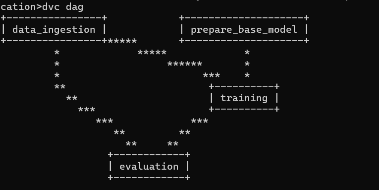

# Classification_Caner_Mlflow-DVC

## 1.Creation of the Pipeline 

step1.Update config.yaml file : 

step2. update params.yaml

step3. Update entity.yaml

step4. update the config manager from src 

## 2.Using MLflow remotely with Dragshub server 

Review Demonstration [https://github.com/yusufM03/MLflow_Tracking]

## 3. DVC cmd for tracking the pipeline automatically
`dvc init
dvc repro
dvc dag `

